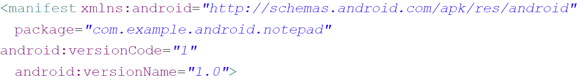
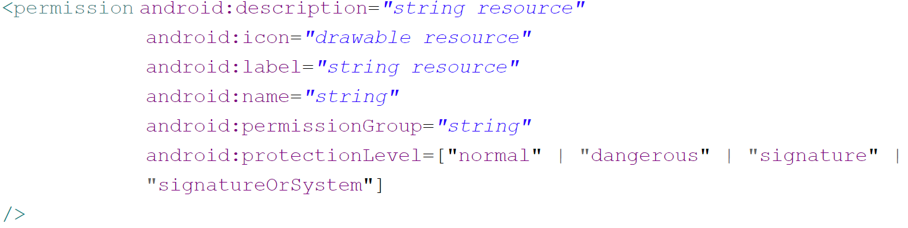

## **Manifests**
 - Application Components
	 - Activity
	 	 – UI(User Interface)를 구성하는 기본 단위
	 - Service
	 	 – UI가 없어 보이지는 않지만 Background에서 무한히 실행되는 컴포넌트(음악 어플, 네트워크 감시, 백그라운드 계산)
	 - Broadcast Receiver
	 	 – 시스템으로부터 전달되는 방송을 대기하고 신호 전달시 수신하는 역할(베터리 부족, 사진 찍기)
	 - Content Provider
	 	 – 다른 응용 프로그램을 위해 자신의 데이터를 제공(응용 프로그램간의 데이터 공유 수단)
 - Intent
	 - 4가지 컴포넌트들은 서로 독립적으로 동작하여 상호간의 통신을 위한 장치가 필요한데 이 역할을 인텐트가 담당함
	 - 컴포넌트간의 통신수단

 - Manifests
	 - `<manifest xmlns:android="Java Package의 이름">`
	 	- AndroidManifest.xml의 root element로써 전체를 감싸는 구조
</img>

	 - `<uses-permission android:name="<permission> 엘리먼트를 사용해 정의된 퍼미션의 이름">`
		 - 안드로이드가 제공하는 권한 이외에 다른 권한이 필요할 때 정의
		 
</img>

 - Intent Filter
	 - ... 추후 추가 예정