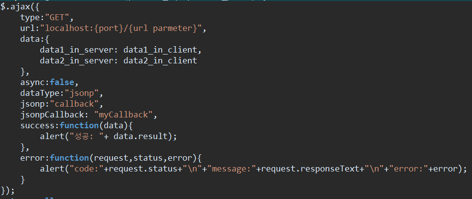
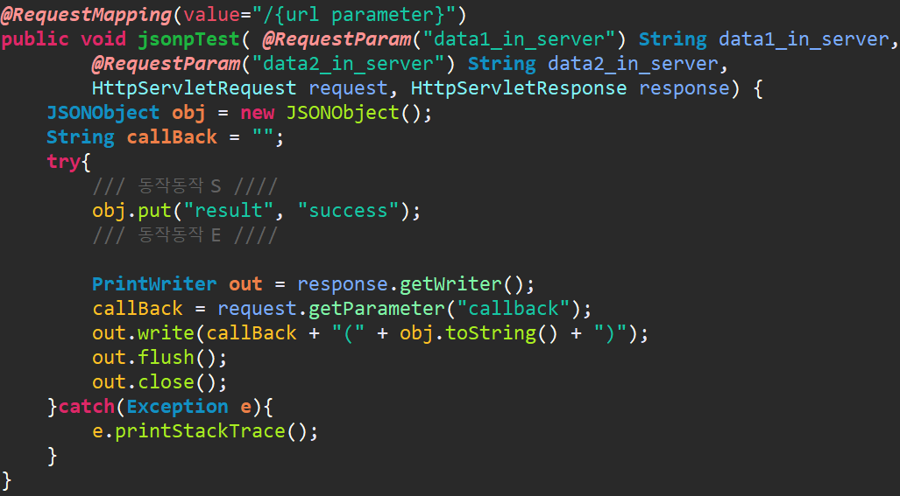

# JSONP

## JSONP Intro
 - ** XMLHttpRequest object 대신 `<script>`를 이용**
	 - 동일 근원정책(Same-Origin Policy, SOP)을 피하기 위함
		 - 자바스크립트는 서로 다른 도메인(cross-domain)에 대한 요청을 보안상 제한함
	 - 본래 자바 스크립트에서는 Ajax를 비롯한 어떤 방법도 직접 다른 도메인의 웹페이지로 데이터를 요청할 수 없지만 `<Script>`요소는 도메인이 다른 스크립트 파일이라 하더라도 임베드 가능

## The Server File
 - 서버 안의 파일은 결과를 function call안에 감싼다.
	```
	<?php
	$myJSON = '{ "name":"John", "age":30, "city":"New York" }';
	echo "myFunc(".$myJSON.");";
	?>
	```
	 - 설명
		 - 결과값: `myFunc({ "name":"John", "age":30, "city":"New York" });`
		 ➜ 결과값은 JSON데이터를 "myFunc"라는 function안에 담아 parameter로 return (해야)한다.

## Dynamic JSONP Result
 - 위의 예시 또한 여전히 정적이다.
 - 다음은 JSON을 php파일에 보냄으로써 동적으로 만드는 예시이다. 그리고 php파일은 JSON 객체를 반환한다.
	 - PHP파일

	```
	<?php
		header("Content-Type: application/json; charset=UTF-8");
		$obj = json_decode($_GET["x"], false);
		$conn = new mysqli("myServer", "myUser", "myPassword", "Northwind");	
		$result = $conn->query("SELECT name FROM ".$obj->$table." LIMIT ".$obj->$limit);
		$outp = array();
		$outp = $result->fetch_all(MYSQLI_ASSOC);

		echo "myFunc(".json_encode($outp).")";
	?>
	```

	 - 설명
		 1. PHP 함수 `json_decode()`를 이용하여 요청을 객체로 변환한다.
		 2. 데이터베이스에 접근해서 배열을 요청된 데이터로 채운다.
		 3. 배열을 객체에 추가한다.
		 4. `json_encode()`함수를 이용해서 배열을 JSON으로 변환한다.
		 5. 리턴 객체를 `myFunc()`로 감싼다.
	 - JavaScript 예제
		 - `myFunc()`는 위의 php 파일로부터 호출된다.

	```
	function clickButton() {
		var obj, s
		obj = { "table":"products", "limit":10 };
		s = document.createElement("script");
		s.src = "jsonp_demo_db.php?x=" + JSON.stringify(obj);
		document.body.appendChild(s);
	}

	function myFunc(myObj) {
		var x, txt = "";
		for (x in myObj) {
			txt += myObj[x].name + "<br>";
		}
		document.getElementById("demo").innerHTML = txt;
	}
	```

### Callback Function
 - 서버 파일을 대한 통제 할 수 없을 경우, 어떻게 서버 파일을 옳은 함수로 전달할 것인가?
 - 때때로 서버 파일은 callback 함수를 parameter로 제공한다.

	```
	function clickButton() {
		var s = document.createElement("script");
		s.src = "jsonp_demo_db.php?callback=myDisplayFunction";
		document.body.appendChild(s);
	}
	function myDisplayFunction(myObj) {
		document.getElementById("demo").innerHTML = myObj.name;
	}
	```

### SampleCode
 - Client 설정
</img>
	 - 필수 처리
	 	 - `type:"GET"`
	 	 	 - GET방식만 가능
	 	 - `async:false`
	 	 	 - 비동기식으로만 가능
	 - 추가된 부분
		 - `dataType:"jsonp"`
			 - 전송 데이터 타입을 jsonp로 지정
		 - `jsonp:"callback"`
			 - 서버로 전송하는 데이터를 callback으로 감쌈
			 - Server에서 받는 부분과 맞춰줘야함
		 - `jsonpCallback: "myCallback"`
			 - 서버에서 돌려받은 데이터를 감쌈
			 - 해당 Function을 거친 후 Success로 이동  
 - Server 설정(Spring MVC 기준)
</img>
	 - json값들을 callBack으로 묶어서 return
	 - `callBack({ "result":"success" });`

### 참고
 - [w3schools.com](https://www.w3schools.com/js/js_json_jsonp.asp "JSONP")
	 - 전체적인 그림
 - [Epiloum 개발노트](http://dev.epiloum.net/1311 "자바스크립트 예제로 살펴보는 JSONP의 기본원리")
	 - 내용 추가
 - [Kingbbode](http://kingbbode.tistory.com/26 "JSONP 알고쓰자")
 	 - 내용 추가
